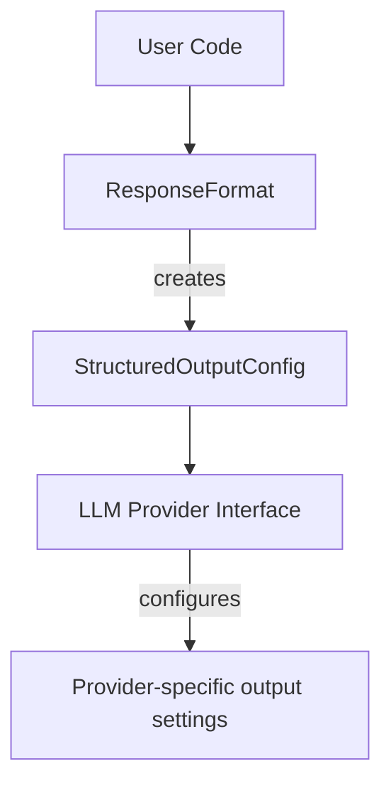

# LLM Module Architecture

This module handles LLM (Large Language Model) interactions, response formatting, and provider interfaces.

## Key Components

### Response Handling (`responses.py`)

The response handling system uses two main classes with distinct responsibilities:

1. **ResponseFormat**
   - User-facing configuration class
   - Handles validation, parsing, and retry logic
   - Creates provider-agnostic configuration for LLM interfaces

2. **StructuredOutputConfig**
   - Data Transfer Object (DTO) between ResponseFormat and LLM interfaces
   - Encapsulates minimal configuration needed by providers
   - Maintains clean separation between configuration and implementation

This separation follows key design principles:
- Interface segregation (providers only see what they need)
- Separation of concerns (configuration vs validation/parsing)
- Loose coupling (providers don't depend on validation logic)

### Capability-Based Model Selection (`llm_registry.py`)

The LLM Registry provides capability-based model selection, allowing you to dynamically select models based on required capabilities:

1. **find_cheapest_model_with_capabilities**
   - Returns the cheapest model that supports all specified capabilities
   - Calculates cost based on input and output tokens per 1,000 tokens
   - Returns None if no model meets the requirements

2. **find_models_with_capabilities**
   - Returns all models that support the specified capabilities
   - Useful for getting a list of compatible models

Example usage:
```python
# Find the cheapest model that supports vision
model_name = llm_registry.find_cheapest_model_with_capabilities({"supports_vision"})

# Find all models that support function calling and JSON mode
models = llm_registry.find_models_with_capabilities({"supports_function_calling", "supports_json_mode"})
```

Available capabilities are defined in `capabilities.py` and include:
- `supports_streaming`: Model supports streaming responses
- `supports_function_calling`: Model supports function calling
- `supports_vision`: Model supports processing images
- `supports_embeddings`: Model supports generating embeddings
- And many more...

### Component Flow



### Provider Interfaces

Provider interfaces consume StructuredOutputConfig through the `configure_structured_output()` method, which:
1. Handles both Pydantic models and JSON schemas
2. Converts configuration to provider-specific settings
3. Maintains abstraction between generic configuration and specific implementation

## Directory Structure

- `responses.py` - Response formatting and validation
- `interfaces/` - Provider-specific implementations
- `schema_utils.py` - Schema handling utilities
- `models.py` - Core data models
- `enums.py` - Shared enumerations
- `capabilities.py` - Provider capability definitions
- `llm_registry.py` - Provider registration and management
- `credentials.py` - Credential management
- `rate_limiter.py` - Rate limiting implementation
- `types.py` - Common type definitions

## Best Practices

1. Use Pydantic models for structured output when possible
2. Leverage StructuredOutputConfig for provider interface implementation
3. Keep provider-specific logic isolated in interface implementations
4. Use ResponseFormat for user-facing configuration
5. Use capability-based model selection instead of hardcoding model names
6. Specify only the capabilities you actually need for your task

## Implementation Notes

- ResponseFormat uses StructuredOutputConfig's effective_schema for validation
- Provider interfaces should handle both direct Pydantic models and converted JSON schemas
- Configuration and implementation concerns are kept separate through the DTO pattern
- Capability-based selection uses the sum of input and output costs for cost comparison
